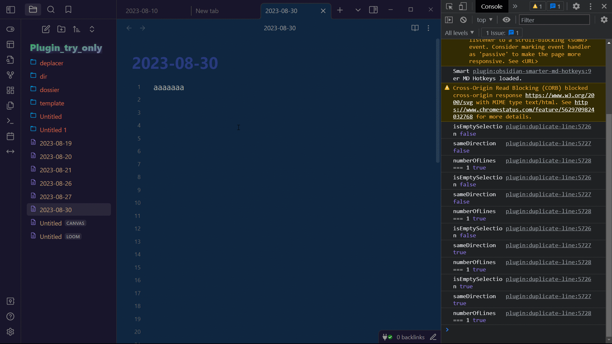

# duplicate-line(s) / Add next occurence
  
this plugin was at first a simple plugin to duplicate lines up and down  
then I added more options. Some options were greatly inspired by obsidian-tweaks. But I fixed a lot of bugs.  
I tried to make some pull request on this repo but no answer. But thanks to him for many things.  
  
All commands (can be disabled in settings):  
Duplicate Line Down, (recommanded shortcut shift alt ↓)  
Duplicate Line Up, (recommanded shortcut shift alt ↑)  
Duplicate Selection Down, (recommanded shortcut ctrl shift ↓)  
Duplicate Selection Up, (recommanded shortcut ctrl shift ↑)  
Duplicate Selection Right, (recommanded shortcut ctrl shift →)  
Move Right, (recommanded shortcut alt →)  
Move Left, (recommanded shortcut alt ←)  
Add next occurence", (ctrl D)  
Select all occurences, (ctrl shift L)  
Duplicate Selection Right/Line Down (feature request). When no selection duplicate line down, when selection duplicate right.  
  
Selection can be multiline and multicursors  
if no selection the word before or under cursor is selected, when using selection operations  
if no selection, the whole line is used, when using duplicate operations. if selection multiline then duplicate   multiline... it's quite intuitive, make some tries  
  
All commands can be enabled/disabled in settings.  
  

